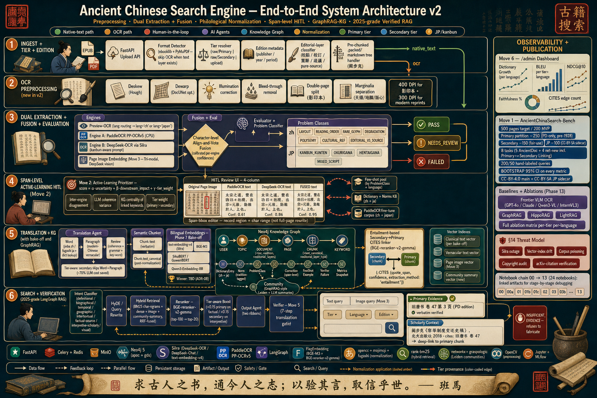

# Ancient Chinese Search Engine

A research-grade retrieval system for Ancient Chinese primary sources.
The pipeline ingests scanned and native PDFs, runs three-engine OCR with
character-level fusion, normalizes classical Chinese through a 7-step
philological pipeline, builds a Neo4j knowledge graph (chunks, keywords,
citations, communities), and serves a hybrid (BM25 + dense + RRF +
cross-encoder rerank) search with a **deterministic citation verifier**
that gates every result.

The goal is **zero-hallucination retrieval over classical Chinese**:
every passage shown in the UI is provably present in the OCR'd source —
modulo philological normalization (T-S, 異體字, 避諱, and optional 通假字).

---

## Architecture



The figure above is the canonical reference for the pipeline. Six stages
(Ingest, Preprocessing, Dual Extraction + Fusion, Span-level HITL,
Translation + KG, Search + Verification), with observability and
evaluation harnesses on the right.

### Stack

| Layer | Technology |
|---|---|
| Language / runtime | Python 3.12 + [uv](https://docs.astral.sh/uv/) |
| Graph store | Neo4j 5.18 (APOC + GDS via plugins) |
| OCR | PaddleOCR + DeepSeek-OCR + Qwen-VL (three-engine fusion) |
| Layout | PP-StructureV3 |
| LLMs | Silra (OpenAI-compatible) — `deepseek-chat`, `text-embedding-v4` |
| Re-ranker | BAAI `bge-reranker-v2-gemma` |
| Object store | MinIO (S3-compatible) |
| Auth / metadata | PostgreSQL 16 |
| Job queue / cache | Redis 7 |
| Backend | FastAPI |
| Frontend | Alpine.js SPA (single page, no build step) |

---

## Quickstart

### 1. Prerequisites
- Docker Desktop
- [uv](https://docs.astral.sh/uv/) installed
- A Silra (or any OpenAI-compatible) API key
- ~10 GB free disk (Neo4j + MinIO volumes)

### 2. Configure
```bash
git clone https://github.com/<your-org>/ancient-china.git
cd ancient-china
cp .env.example .env
# edit .env — at minimum set LLM_API_KEY, NEO4J_PASSWORD,
# POSTGRES_PASSWORD, MINIO_ROOT_PASSWORD, REDIS_PASSWORD
```

### 3. Bring up infrastructure
```bash
docker compose up -d neo4j redis minio postgres
```
- Neo4j browser → http://localhost:7474 (user `neo4j`, password from `.env`)
- MinIO console → http://localhost:9001

All infra ports bind to `127.0.0.1` only.

### 4. Install Python deps
```bash
uv sync
```

### 5. Drop sources into `raw/`
The repo ships **without** corpus PDFs (they are not redistributable).
Place primary and secondary sources under `raw/primary/` and
`raw/secondary/`; the readers will tier them via
`scripts/run_index_pipeline.py`.

---

## Running the pipeline

Each stage is **idempotent + resumable**. Re-running a script picks up
where it left off.

```bash
# Stage 1 — ingest + tier + editorial-layer classification
uv run python scripts/run_index_pipeline.py

# Stage 2 — preprocess (deskew, dewarp, illumination, bleed, page-split, marginalia)
uv run python scripts/run_preprocess.py

# Stage 3 — OCR (three engines, run in parallel)
uv run python scripts/run_paddle_ocr.py
uv run python scripts/run_deepseek_ocr.py
uv run python scripts/run_qwen_ocr.py

# Stage 4 — char-level fusion → layout analysis (PP-StructureV3)
uv run python scripts/run_fusion.py
uv run python scripts/run_layout_analysis.py

# Stage 5 — evaluator + problem classifier
uv run python scripts/run_evaluator.py

# Stage 6 — translation (canonical + vernacular)
uv run python scripts/run_translation.py --batch-size 10 --workers 8

# Stage 7 — chunking + embeddings (Silra batch cap is 10)
uv run python scripts/run_chunking.py
uv run python scripts/run_embedding.py --batch-size 10

# Stage 8 — keywords + RELATED edges
uv run python scripts/run_keyword_extraction.py --workers 12
uv run python scripts/run_keyword_relate.py

# Stage 9 — CITES linker + Leiden communities + community summaries
uv run python scripts/run_citation_linker.py
uv run python scripts/run_communities.py
```

---

## API + UI

```bash
uv run python scripts/run_server.py            # FastAPI on :8000
open http://localhost:8000                     # Alpine.js SPA
```

The SPA exposes three panels:
- **Upload** — drop a PDF; the full pipeline runs in the background.
- **HITL** — span-level correction queue with active-learning sampling.
- **Ask / Notes / History** — interactive retrieval with inline citation chips.

### How verification works

Every retrieved chunk passes through the deterministic verifier in
`apps/backend/agents/verifier.py` before it can be returned by
`/search`. The verifier runs the candidate cited *span* and the chunk's
`textCanonical` through the 7-step normalization pipeline (NFC →
whitespace → T-S → 異體字 → 避諱 → optional 通假字 → mojimoji), then
checks substring containment. Outcomes:

- **`ok`** — span found in the canonical source text. Result is shown
  with the appropriate evidence-strength badge
  (`primary_source` / `primary_疏議` / `editorial_commentary` /
  `scholarly_interpretation`).
- **`translation_match`** — span only found in the LLM-generated
  vernacular translation. Result is shown but **not** marked
  `verified`; the badge is `translation_match`.
- **`not_applicable`** — the query contained no verbatim classical-
  Chinese span of length ≥ 4 to verify against (typical for natural-
  language questions). Result is shown unflagged.
- **`insufficient_evidence`** — the span is missing, the chunk is
  missing, or the span is too short to be diagnostic. The result is
  **dropped from the ribbon** and counted in `gated_count`. A
  `(:VERIFIER_FAILURE)` node is written to Neo4j for audit.

The verifier's guarantee is: *"the span is present in the source modulo
philological normalization"*. It is **not** a claim of semantic support
— for that, the LLM evidence-scorer in
`apps/backend/pipeline/evidence_scorer.py` runs first as a re-ranker.

### BM25 freshness

The BM25 index is built in memory from the whole CHUNK corpus when the
server starts and held on `app.state.bm25_corpus`. **New uploads are not
reflected in BM25 results until the server restarts.** Dense (vector)
retrieval picks up new chunks immediately. The `/search` response
includes `"bm25_ready": bool` so clients can show a warning when only
dense retrieval is available.

---

## Evaluation

```bash
uv run python -m eval.harness --bench data/bench --out eval_out
cat eval_out/summary.txt
```

Produces `eval_out/metrics.json` with NDCG@10, Recall@k, faithfulness,
and **bootstrap 95% CIs** (10k resamples). Bench layout under
`data/bench/`:
- `queries.jsonl` — search queries with relevant chunk ids
- `faithfulness.jsonl` — faithful spans for the verifier
- `linking_gold.jsonl` — secondary → primary CITES gold pairs

Tests:
```bash
uv run pytest apps/backend/tests -q
```

---

## Repository layout

```
apps/
  backend/         FastAPI + pipeline modules
    agents/        intent, HyDE, rerank, output (two-ribbon + verifier gate),
                   verifier (deterministic citation gate),
                   relevance_scorer (LLM evidence scoring)
    api/           HTTP routes + SPA mount
    feedback/      active learning + correction writer
    graph/         Neo4j client + schema migrations
    kb/            dictionary, norms, language rules
    lang/          language detection + tokenization
    llm/           Silra client wrapper (retries + Retry-After)
    normalize/     classical-Chinese normalization (7-step pipeline)
    ocr/           paddle / deepseek / qwen-vl + char-level fusion
    pipeline/      ingest → preprocess → fusion → layout → translate →
                   chunk → embed → keywords → citations → communities;
                   evidence_scorer (LLM re-rank)
    preprocess/    six-step image chain (deskew / dewarp / illumination /
                   bleed / page-split / marginalia)
    readers/       PDF + EPUB + image + packed-markdown readers
    retrieval/     bm25 / dense / fuse (RRF) / community
    storage/       MinIO + Neo4j drivers
    tests/         pytest suite
  frontend/        Alpine.js SPA (single index.html + static/)
scripts/           production runners for each stage
eval/              evaluation harness with bootstrap CIs
data/
  bench/           eval gold data
  seeds/           normalization seeds + dictionaries
docs/              architecture diagram + ADRs
docker-compose.yml Neo4j / Redis / MinIO / Postgres / app
```

---

## License

MIT — see [LICENSE](LICENSE). The source corpus under `raw/` is
**excluded** from this repository and is subject to the publishers' own
copyrights; only the pipeline code is MIT.
