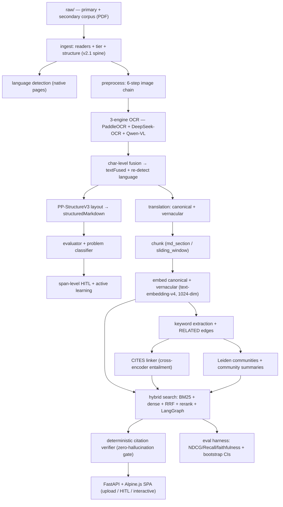

# Ancient China Knowledge Graph

A research-grade retrieval system for Ancient China primary sources. The pipeline ingests scanned and native PDFs, runs a three-engine OCR with char-level fusion, builds a graph in Neo4j (chunks, keywords, citations, communities), translates classical Chinese into a canonical modern form, and serves a hybrid (BM25 + dense + RRF + cross-encoder rerank) search backed by a **deterministic citation verifier** that gates every claim.

The goal is *zero-hallucination retrieval over classical Chinese*: every passage shown in the UI is provably present in a numbered source page.

---

## Architecture




### Stack

| Layer | Technology |
|---|---|
| Language / runtime | Python 3.12 + [uv](https://docs.astral.sh/uv/) |
| Graph store | Neo4j 5.18 (APOC + GDS via plugins) |
| OCR | PaddleOCR + DeepSeek-OCR + Qwen-VL (3-engine fusion) |
| Layout | PP-StructureV3 |
| LLMs | Silra (OpenAI-compatible API) — `deepseek-chat`, `text-embedding-v4` |
| Re-ranker | BAAI `bge-reranker-v2-gemma` |
| Object store | MinIO (S3-compatible) |
| Auth / metadata | PostgreSQL 16 |
| Job queue / cache | Redis 7 |
| Backend | FastAPI |
| Frontend | Alpine.js SPA (single page, no build step) |

---

## Quickstart

### 1. Prerequisites
- Docker Desktop
- [uv](https://docs.astral.sh/uv/) installed
- A Silra (or any OpenAI-compatible) API key
- ~10 GB free disk (Neo4j + MinIO volumes)

### 2. Configure
```bash
git clone https://github.com/<your-org>/ancient-china.git
cd ancient-china
cp .env.example .env
# edit .env — set LLM_API_KEY at minimum
```

### 3. Bring up infrastructure
```bash
docker compose up -d neo4j redis minio postgres
```
- Neo4j browser → http://localhost:7474 (`neo4j` / `AncientChina`)
- MinIO console → http://localhost:9001

### 4. Install Python deps + register the kernel
```bash
uv sync
uv run python -m ipykernel install --user --name ancient-china \
  --display-name "Ancient China (uv)"
```

### 5. Drop sources into `raw/`
The repo ships **without** corpus PDFs (they are not redistributable). Place your own primary and secondary sources under `raw/primary/` and `raw/secondary/` — the readers will tier them via `scripts/run_index_pipeline.py`.

---

## Running the pipeline

Each stage is **idempotent + resumable**. Re-running a script picks up where it left off. The two equivalent paths:

### Notebooks (exploratory, per-stage artifacts under `notebooks/_artifacts/`)
Run `notebooks/RUN_ALL.md` top-to-bottom:
```
00 → 00a → 01 → 01b → 01c → 02 → 03 → 03b → 03c
→ 04 → 05 → 05b → 06 → 07 → 08 → 08b → 08c
→ 09 → 09b → 10 → 11 → 11b → 12 → 13
```

### Scripts (production, log to `logs/`)
```bash
# Stage 1 — ingest + tier
uv run python scripts/run_index_pipeline.py

# Stage 2 — OCR (3 engines, parallel)
uv run python scripts/run_paddle_ocr.py
uv run python scripts/run_deepseek_ocr.py
uv run python scripts/run_qwen_ocr.py

# Stage 3 — fusion → layout
uv run python scripts/run_fusion.py
uv run python scripts/run_layout_analysis.py

# Stage 4 — evaluator + classifier
uv run python scripts/run_evaluator.py

# Stage 5 — translation (canonical + vernacular)
caffeinate -dimsu uv run python scripts/run_translation.py \
  --batch-size 10 --workers 8 --log-file logs/translation.log

# Stage 6 — chunking + embeddings (Silra batch cap is 10)
uv run python scripts/run_chunking.py
uv run python scripts/run_embedding.py --batch-size 10

# Stage 7 — keywords + RELATED edges
uv run python scripts/run_keyword_extraction.py --workers 12
uv run python scripts/run_keyword_relate.py

# Stage 8 — CITES + Leiden communities
uv run python scripts/run_citation_linker.py
uv run python scripts/run_communities.py
```

After any code change, refresh the knowledge graph:
```bash
uv run graphify update .
```

---

## API + UI

```bash
uv run python scripts/run_server.py            # FastAPI on :8000
open http://localhost:8000                     # Alpine.js SPA
```

The SPA exposes three panels:
- **Upload** — drop a PDF, the full pipeline runs in the background.
- **HITL** — span-level correction queue (active learning sampling).
- **Ask / Notes / History** — interactive retrieval with inline citation chips.

Every answer is **verified deterministically** against the cited chunk's `pageNumber` and offsets before it ever reaches the user (see `apps/backend/retrieval/verifier.py`).

---

## Evaluation

```bash
uv run python -m eval.harness --bench data/bench --out eval_out
cat eval_out/summary.txt
```

Produces `eval_out/metrics.json` with NDCG@10, Recall@k, faithfulness, and **bootstrap 95% CIs** (10k resamples). Bench layout under `data/bench/`:
- `queries.jsonl` — search queries with relevant chunk ids
- `faithfulness.jsonl` — faithful spans for the verifier
- `linking_gold.jsonl` — secondary → primary CITES gold pairs

Tests:
```bash
uv run pytest apps/backend/tests -q
```

---

## Repository layout

```
apps/
  backend/         FastAPI + pipeline modules
    agents/        translation, evaluator, classifier
    api/           HTTP routes + SPA mount
    graph/         Neo4j queries + schema migrations
    kb/            chunking, keywords, communities, citations
    lang/          language detection + normalization
    llm/           Silra client wrappers + retries
    normalize/     classical-Chinese normalizer
    ocr/           paddle / deepseek / qwen-vl + fusion
    pipeline/      orchestrator + layout
    preprocess/    6-step image preprocessing
    readers/       PDF + structured doc readers
    retrieval/     hybrid search + verifier + LangGraph
    storage/       MinIO + Neo4j drivers
    tests/         pytest suite
  frontend/        Alpine.js SPA (single index.html + static/)
notebooks/         00 → 13 exploratory pipeline (artifacts under _artifacts/)
scripts/           production runners for each stage
eval/              AncientChinaSearch-Bench harness
data/
  bench/           eval gold data
  seeds/           normalization seeds + dictionaries
docs/              architecture diagram + ADRs
docker-compose.yml Neo4j / Redis / MinIO / Postgres / app
```

---

## Conventions
See [AGENTS.md](AGENTS.md) for the full set of project rules. Highlights:
- `uv run python <file>` — never activate the venv manually
- Node labels `UPPER_SNAKE_CASE`, property keys `camelCase`, parametrized Cypher only
- Notebooks pin the `ancient-china` ipykernel and persist outputs under `notebooks/_artifacts/<stage>/`
- ADRs land in `AGENTS.md` §11 (Dynamic Rules Log)

---

## License

MIT — see [LICENSE](LICENSE).
The source corpus under `raw/` is **excluded** from this repository and is subject to the publishers' own copyrights; only the pipeline code is MIT.
